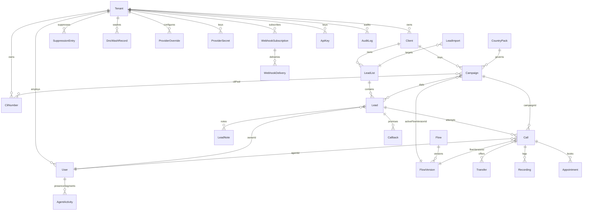

# CoCally data model

> Written 2026-09-21 from the Mongoose schemas in `apps/api/src/schemas/` (17 files, 26 collections) and the enums in `packages/shared/src/enums.ts`. Every schema has `timestamps: true` (AuditLog: `createdAt` only). Every tenant-owned collection carries `tenantId` and its indexes lead with it.

## The four documents that matter most

### Call (`call.schema.ts`) — one dial attempt, AI leg and human leg
Refs: `tenantId`, `campaignId`, `leadId`, `flowVersionId`, `agentId`, `transferredFromAgentId`, `supervisorId`, `participantAgentIds[]`.

| Group | Fields |
|---|---|
| Identity | `direction` OUTBOUND/INBOUND, `cli`, `manual`, `predictive`, `sipCallId`, `sipStatusCode` |
| State | `state` DIALING → RINGING → AMD_CLASSIFYING → IN_CONVERSATION → TRANSFER_PENDING → BRIDGED / ON_HOLD → WRAP_UP → COMPLETED or FAILED |
| Timing | `startedAt`, `answeredAt`, `bridgedAt`, `endedAt`, `ringMs`, `wrapUpDeadline`, `timings {sttFirstPartial, ttsFirstByte, turnLatencies[], transferDeadAirMs}` |
| Answer | `amdClass` HUMAN/VOICEMAIL/IVR/FAX/SILENCE, `amdLatencyMs` |
| Conversation | `transcript[] {leg AI/HUMAN, speaker ai/customer/agent, text, redactedText, startMs, endMs}`, `summary`, `scoreHistory[] {atMs, score, reason}`, `finalScore`, `objections[] {label, recovered}` |
| Compliance | `complianceEvents[] {atMs, kind, detail}` kind ∈ RECORDING_DISCLOSURE, AI_IDENTIFICATION, CONSENT, OPT_OUT_DETECTED, DISTRESS_EXIT, WINDOW_CHECK, DNC_CHECK, ABANDONED_CALL_NOTICE, DTMF_OPT_OUT, SUPERVISION_ATTACHED |
| Outcome | `outcome` ANSWERED_HUMAN/ANSWERED_VOICEMAIL/ANSWERED_IVR/BUSY/NO_ANSWER/DISCONNECTED/FAILED/CALLBACK_REQUESTED/OPT_OUT/ABANDONED, `endReason` (SIP-derived), `disposition` BOOKED/CALLBACK/NOT_INTERESTED/NOT_QUALIFIED/WRONG_NUMBER/DO_NOT_CALL/FOLLOW_UP, `dispositionNotes` |
| Quality and cost | `qaScore {total, breakdown, notes}`, `costCents {telco, stt, tts, llm}`, `providersUsed` |
| Media | `recordingEgressId`, `recordingUri`, `holdCount`, `heldMs`, `supervisionMode` MONITOR/WHISPER/BARGE |

Indexes: tenant+campaign+startedAt, lead+startedAt, tenant+agent+bridgedAt, tenant+campaign+disposition, tenant+campaign+outcome, state+startedAt, agent+state, wrapUpDeadline.

### Lead (`lead.schema.ts`) — the dialable contact plus its history
Refs: `tenantId`, `clientId`, `listId`, `campaignId`, `ownerId`, `manualClaimedBy`, `preferredAgentId`.

- Contact: `phone` E.164, `altPhones[]`, `lineType`, `email`, `firstName`, `lastName`, `suburb`, `state` (geographic), `postcode`, `timezone` (required, drives calling windows), `custom` map, `tags[]`.
- Lifecycle: `state_` FRESH → ATTEMPTED → CONTACTED → QUALIFIED → TRANSFERRED → BOOKED, or CALLBACK / NURTURE / EXHAUSTED / DNC. Note the underscore: `state` is the Australian state, `state_` is lifecycle.
- Dialing: `attempts`, `nextAttemptAt`, `lockedAt` (atomic dialer claim), `manualClaimedAt`, `lastContactedAt`.
- Captured: `facts` map (merged from every AI turn), `score`.
- Compliance: `dncWashedAt`, `dncListed`.
- `timeline[] {at, kind, detail, state?, callId?}` capped at 300 entries.

Indexes: tenant+campaign+phone, tenant+phone, campaign+state_+nextAttemptAt+manualClaimedBy (the dialer scan), tenant+owner+state_+score, tenant+tags.

Same file: **LeadList** (name, campaignId, priority, status), **LeadImport** (filename, total, accepted, duplicates, rejected, rejects[]), **LeadNote** (leadId, authorId, text, pinned).

### Campaign (`campaign.schema.ts`) — all dialing, pacing, compliance and AI config for one programme
Refs: `tenantId`, `clientId`, `activeFlowVersionId`, `voicemailDropAssetId`, `cliPool[]`.

- `status` DRAFT/ACTIVE/PAUSED/COMPLETED, `countryPackCode`, `abSplits[] {flowVersionId, percent}`.
- Pacing: `dailyDialBudget`, `maxConcurrentCalls`, `dialsPerAvailableAgent`, `predictiveDialing {enabled, ratio, minRatio, maxRatio, maxAbandonRatePercent, abandonTimeoutSeconds}`.
- Behaviour: `noAgentFallback` BOOK/HOLD/AI_CLOSE, `voicemailPolicy`, `ivrPolicy`, `cliRules {geoMatch, rotation}`, `retryMatrix[] {outcome, delayMinutes, shiftTimeBand, maxAttempts}`, `frequencyCapDays`, `schedule[]`.
- AI: `scoring` (weights + thresholds, required), `rebuttals[] {objection, rebuttal}`, `aiSelfIdentification`, `transcriptionMode`, `sttKeywords[]`, `summaryTemplate`.
- Routing: `routingStrategy` LONGEST_IDLE/ROUND_ROBIN/LEAST_TALK_TIME/SKILL_PRIORITY/STICKY, `transferAcceptWindowSeconds` (13), `whisperEnabled`.

### Transfer (`transfer.schema.ts`) — one AI to human hand-off cascade
Refs: `tenantId`, `callId`, `leadId`, `campaignId`, `acceptedAgentId`.
`state` RESERVED → OFFERED → ACCEPTED / DECLINED / TIMED_OUT → BRIDGED, or CANCELLED / FALLBACK. `attempts[] {agentId, offeredAt, resolvedAt, result}` one per agent tried. `card` is the snapshotted briefing card. `bridgedAt`, `bridgeDeadAirMs`, `whisperText`.

## Supporting collections

| Collection | Purpose | Key fields |
|---|---|---|
| Recording | one audio or transcript leg | `callId`, `leadId`, `leg` AI/WHISPER/HUMAN, `storagePath`, `region`, `durationMs`, `timelineOffsetMs`, `legalHold`, `purgeAfter` |
| AgentActivity | one presence segment, server-written | `userId`, `state`, `pauseCode`, `startedAt`, `endedAt`, `durationSeconds` |
| Appointment | booking from a BOOKED disposition | `leadId`, `callId`, `startsAt`, `durationMinutes`, `slotKey` (partial-unique per client), `status` |
| Callback | promised call-back task | `leadId`, `dueAt`, `handler` AI/HUMAN, `preferredAgentId`, `status` |
| User | staff | `email`, `roles[]` OWNER/ADMIN/SUPERVISOR/AGENT/QA/API_CLIENT, `passwordHash`, `totpSecret`, `skills[]`, `presence`, `pauseCode`, `clockedInAt`, `talkTimeTodaySeconds` |
| CliNumber | outbound caller ID | `number`, `geoRegion`, `status` ACTIVE/RESTING/QUARANTINED, `dialsToday`, `answersToday`, `answerRate7d`, `quarantineReason` |
| Flow / FlowVersion | conversation graph, immutable once published | `graph` (node types PLAY_AUDIO, SPEAK, AI_CONVERSATION, LISTEN_CAPTURE, AMD_CLASSIFY, SEND_DTMF, BRANCH, TRANSFER, WEBHOOK, SET_RETRY, END), `version`, `state` DRAFT/PUBLISHED/ARCHIVED |
| PromptAsset | audio prompts | `source` UPLOAD/BROWSER_RECORDING/TTS_FROZEN, `variants` per locale |
| CountryPack | platform-level compliance rules | `dnc {registryName, washExpiryDays, enforced}`, `callingWindows[]`, `publicHolidays[]`, `disclosures {…}`, `timezones[]`, `dataResidencyRegion` |
| SuppressionEntry | opt-outs and client lists | `phone`, `kind` OPT_OUT/CLIENT_SUPPRESSION/MANUAL, `expiresAt` |
| DncWashRecord | ACMA wash result per number | `phone`, `listed`, `washedAt`, `expiresAt` (unique per tenant+phone+pack) |
| ProviderOverride / ProviderSecret | PAL chain per level and AES-GCM key bundle | `level`, `capability` TTS/STT/LLM, `llmRole`, `chain[]`; `ciphertext`, `iv`, `authTag` |
| WebhookSubscription / WebhookDelivery | outbound events | `url`, `events[]`, `secret`; `status`, `attempts`, `nextRetryAt` |
| AuditLog | insert-only admin trail | `actorId`, `action`, `entityType`, `entityId`, `before`, `after`, `ip` |
| ApiKey | scoped programmatic access | `keyHash` (unique), `prefix`, `scopes[]` |
| Tenant / Client | multi-tenancy | `slug`, `region`, `retentionDays`, `paused`; client `name`, `branding` |

## How one call is captured, step by step

1. **Lead claim.** The dialer does a conditional `findOneAndUpdate` on Lead setting `lockedAt`, scanning the campaign+state_+nextAttemptAt index. Stale locks over ten minutes are reclaimed.
2. **Dial.** Call created with `state: DIALING`, `startedAt`, `cli`, and `flowVersionId` chosen from the campaign's A/B split or active version. On the live path the LiveKit egress id and SIP call id are written and state moves to RINGING.
3. **Answer and AMD.** `amdClass`, `amdLatencyMs`, `answeredAt`, `ringMs` set. VOICEMAIL runs the campaign's voicemail policy then finishes with ANSWERED_VOICEMAIL. FAX and SILENCE become NO_ANSWER. IVR sends DTMF or finishes with ANSWERED_IVR.
4. **AI turns.** State IN_CONVERSATION. Each line appends to `transcript[]` with `redactedText`, each score change appends to `scoreHistory[]` and updates `finalScore`, each compliance event appends to `complianceEvents[]`, the running `summary` is rewritten. Captured facts accumulate in memory until the leg closes.
5. **Transfer.** Call state TRANSFER_PENDING. A Transfer document is created RESERVED, then per agent tried: User presence RESERVED, Transfer OFFERED, an entry pushed to `attempts[]`, and the briefing `card` snapshotted. Decline or timeout resolves the attempt and cascades. Pool exhausted sets FALLBACK.
6. **Bridge.** Transfer BRIDGED with `acceptedAgentId` and `bridgeDeadAirMs`. Call gets `agentId`, state BRIDGED, `bridgedAt`. Lead gets `preferredAgentId` and a TRANSFER timeline entry. User presence ON_CALL.
7. **AI leg close.** Lead `facts` merged, Lead `score` set, Call `objections` and `finalScore` set. Lead lifecycle transitions to TRANSFERRED, QUALIFIED or NURTURE with a timeline entry. Webhooks queued for lead.qualified, transfer.accepted, lead.optout.
8. **Finish and QA.** `outcome` set, `qaScore` computed by a deterministic rubric over disclosure, engagement, objection recovery and score band. Non-transferred calls get state COMPLETED and `endedAt` here.
9. **Recording.** A Recording row per leg with `storagePath`, `durationMs`, `timelineOffsetMs` (sum of earlier legs for that lead, so legs stitch on one timeline) and `purgeAfter` from tenant retention.
10. **Retry matrix.** For non-transferred outcomes, Lead `attempts` increments, `lastContactedAt` set, and `nextAttemptAt` comes from the matching campaign retry rule, or EXHAUSTED when max attempts is reached.
11. **Live-path finalisation.** One idempotent update guarded on state not already COMPLETED, FAILED or WRAP_UP writes `endReason` from the SIP code, `outcome`, `sipStatusCode`, `endedAt`. Then recording stops, the room is torn down, CLI health counters update (quarantine after five carrier blocks in fifteen minutes), the call.completed webhook fires, and the agent enters WRAP_UP with a `wrapUpDeadline`.
12. **Disposition.** Agent posts `disposition` and notes. Call state COMPLETED, `endedAt`. HUMAN leg Recording created. BOOKED creates an Appointment and fires appointment.booked. CALLBACK creates a Callback and sets Lead `nextAttemptAt`. DO_NOT_CALL sets lifecycle DNC. NOT_INTERESTED and NOT_QUALIFIED go to NURTURE. WRONG_NUMBER goes to EXHAUSTED. Lead claim fields clear, timeline gets a DISPOSITION entry, agent talk time accrues, presence returns to WRAP_UP.
13. **Presence log.** Every presence change closes the open AgentActivity segment with `endedAt` and `durationSeconds` and opens a new one. This is what occupancy and adherence reports read.
14. **Analytics** are read-only aggregations over Call, Lead, Transfer, Recording, AgentActivity and User. Nothing is precomputed except an in-process cache.
